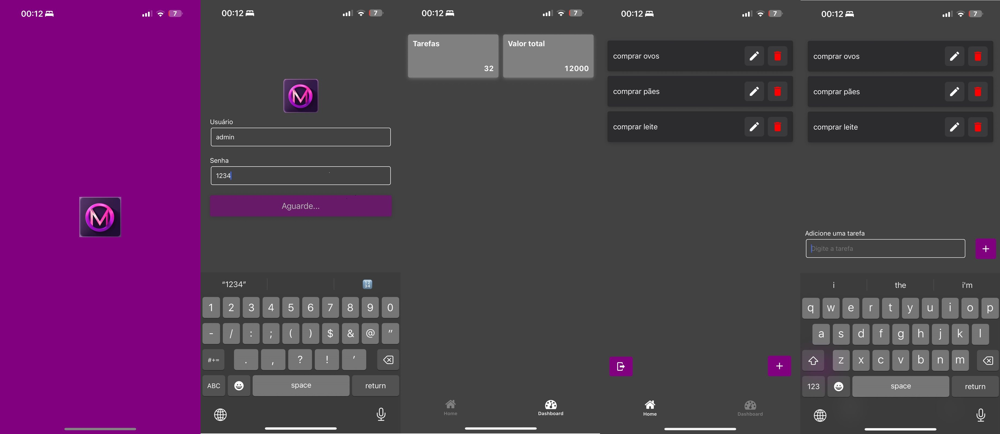

# 📱 Meu App React Native

Aplicativo pessoal desenvolvido com **React Native**, com o objetivo de praticar os principais **conceitos de app nativos**, como autenticação, navegação com transições animadas, manipulação de estados e CRUD. O projeto inclui uma estrutura básica de navegação pós-login com abas, além de uma experiência de uso fluida e intuitiva.

---

## 🚀 Funcionalidades

- ✅ Splash Screen com pré-carregamento e loading
- 🔐 Tela de login com autenticação simulada
- 🧭 Navegação com transições suaves entre telas
- 📋 **CRUD de Tarefas**: criar, listar, editar e excluir
- 📊 Dashboard com cards de resumo (tarefas e valores)
- ⚙️ Organização por abas com navegação inferior
- ✨ Experiência de uso fluida com boas práticas de UX

---

## 🧠 Conceitos Trabalhados

- Componentização com React Native
- Gerenciamento de estado (`useState`, `useEffect`)
- Contexto para autenticação
- Navegação com `React Navigation` e Bottom Tabs
- Lógica de autenticação e controle de rotas
- Listas dinâmicas com `FlatList`
- Estrutura modular de código

---

## 📸 Screenshots

> Splash, login, CRUD de tarefas e dashboard



---

## 🛠️ Como rodar o projeto

```bash
git clone https://github.com/seu-usuario/seu-repo.git
cd seu-repo
npm install
npx react-native run-android # ou run-ios
```
