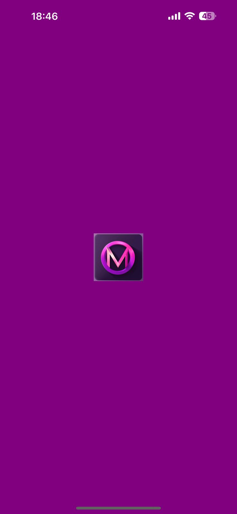
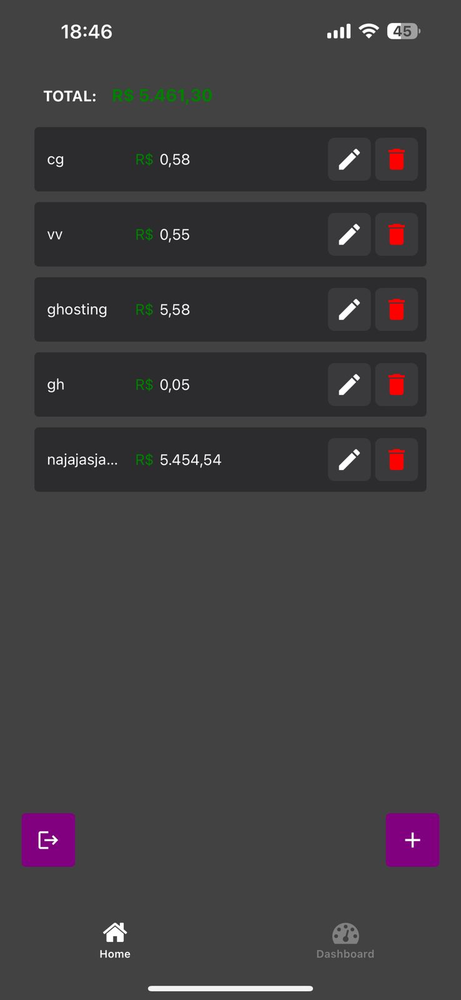
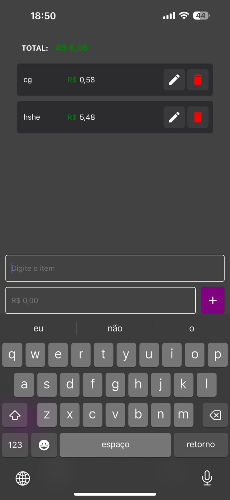
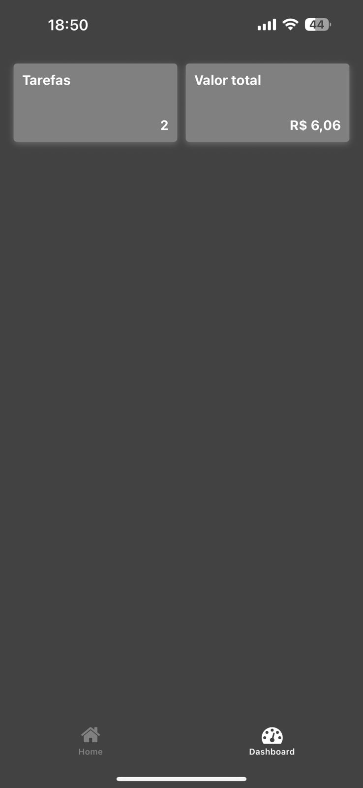

# 📱 Meu App React Native – Lista de Tarefas

Este é um aplicativo pessoal desenvolvido em **React Native**, criado para praticar conceitos essenciais de desenvolvimento de apps nativos, como autenticação, navegação, manipulação de estados e CRUD. O app oferece uma experiência fluida, com transições suaves e animações, e foi estruturado seguindo boas práticas de UX e componentização.  

---

### Splash Screen Animada  

Ao abrir o app, o usuário é recebido por uma **Splash Screen animada**, que exibe o logo e uma animação de carregamento, criando uma introdução elegante e suave antes de acessar a aplicação.  
 
<p align="center">
  
</p>

---

### Tela de Login  

Após o splash, o usuário é direcionado para a **tela de login**, onde pode inserir usuário e senha. O login é simulado com as credenciais:  

- **Usuário:** `admin`  
- **Senha:** `1234`  

Os campos possuem validações em tempo real, garantindo que apenas entradas válidas permitam o acesso. A autenticação é gerenciada por um **Contexto**, garantindo que apenas usuários autenticados possam acessar as demais telas.  

<p align="center">
  
</p>
 
---

### Lista de Tarefas (CRUD)  

Após o login, o usuário acessa a **lista de tarefas**, que permite visualizar, editar e deletar itens. O app utiliza um **FlatList** para exibir as tarefas de forma dinâmica, e cada item pode ser excluído com um efeito de **swipe** suave. É possível editar os itens diretamente na tela e acompanhar a soma total dos valores cadastrados.  

<p align="center">
  
</p>

Na mesma tela, há um botão flutuante que, ao ser pressionado, abre de forma animada os inputs para adicionar um novo item, incluindo o nome e o valor. Assim que o item é adicionado, ele aparece imediatamente na lista e a soma total é atualizada.  

<p align="center">
  
</p>

---

### Dashboard – Resumo de Tarefas  

Além da lista, o app possui uma segunda aba que exibe o **dashboard**, mostrando a quantidade total de tarefas e a soma dos valores. Os números aparecem de forma animada, proporcionando uma visualização dinâmica e intuitiva do resumo das tarefas cadastradas.  

<p align="center">
  
</p>

---

O projeto trabalhou diversos conceitos importantes de React Native, como **componentização**, **hooks (`useState` e `useEffect`)**, **Context API** para autenticação, **navegação com Bottom Tabs**, **listas dinâmicas com FlatList** e boas práticas de UX, incluindo animações, feedback visual e transições suaves.  

---

## Como Rodar o Projeto

```bash
# Clone o repositório
git clone https://github.com/matheuscassioli/price-scanner
cd list-tasks

# Instale as dependências
npm install

# Inicie o app
npm start
